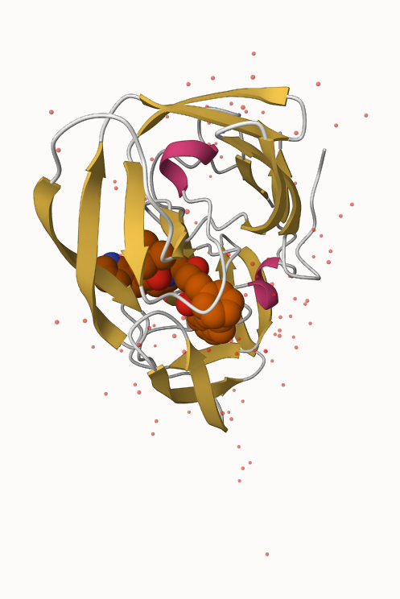
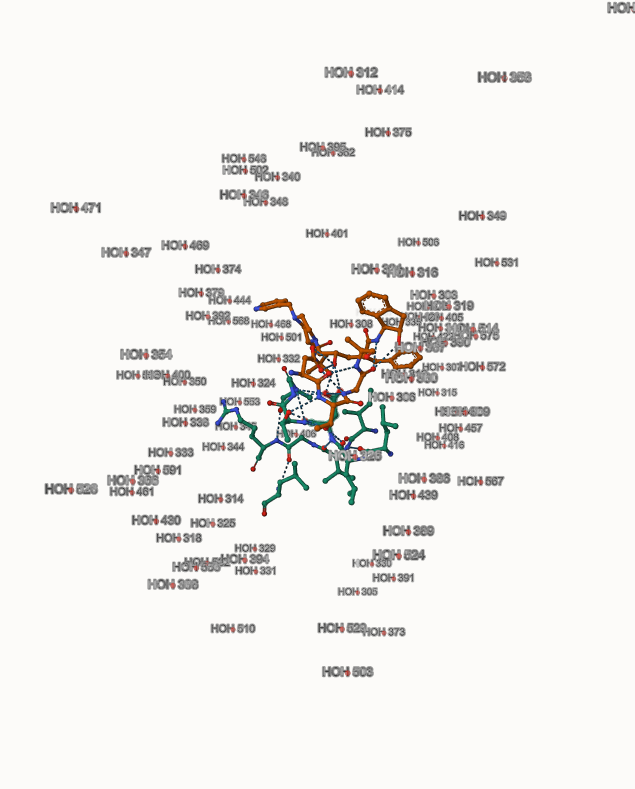
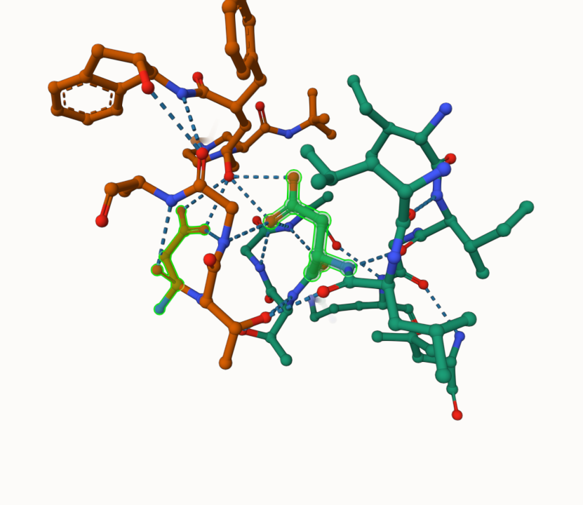

```{r}
library(dplyr)
```

# 1: Introduction to the RCSB Protein Data Bank (PDB)
### PDB Statistics

```{r}
EMMT.df <- read.csv("Data Export Summary.csv", row.names = 1)
```

> Q1: What percentage of structures in the PDB are solved by X-Ray and Electron Microscopy.

92.99%

> Q2: What proportion of structures in the PDB are protein?

0.8681 - Protein(only)
0.9782 - Protein included

> Q3: Type HIV in the PDB website search box on the home page and determine how many HIV-1 protease structures are in the current PDB?

4,926 Structures

# 2. Visualizing the HIV-1 Protease Structure
### Using Mol*

Mol* homepage at: https://molstar.org/viewer/
To load a structure from the PDB we can enter the PDB code and click “Apply” in the “Download Structure” menu.

### Getting to Know HIV-Pr

Let’s temporally toggle OFF/ON the display of water molecules and change the display representation of the Ligand to Spacefill. Three dots for "Ligand" > Add Representation > Spacefill

Let’s also change the protein “Polymer” > “Set Coloring” > “Residue Property” > “Secondary Structure”.

### Saving an Image

Save high-resolution image to computer: find "iris-like" screenshot icon on right side of display region and select resolution and click download.

```{r}
# insert an image

```


#### The Important Role of Water
> Q4: Water molecules normally have 3 atoms. Why do we see just one atom per water molecule in this structure?

When label representation is on, we can see that the one atom per water molecule is named HOH. The red spheres is O.

> Q5: There is a critical “conserved” water molecule in the binding site. Can you identify this water molecule? What residue number does this water molecule have

```{r}

```

HOH 308

> Q6: Generate and save a figure clearly showing the two distinct chains of HIV-protease along with the ligand. You might also consider showing the catalytic residues ASP 25 in each chain and the critical water (we recommend “Ball & Stick” for these side-chains). Add this figure to your Quarto document.

```{r}

```

The image above shows two Asp 25 positions (B and A) in the 3D structure of 1HSG.


# 3.Introduction to Bio3D in R

```{r}
# load Bio3D package
library(bio3d)
```

### Reading PDB File Data into R

```{r}
pdb <- read.pdb("1hsg")
```

```{r}
# quick summary of contents of pdb object
pdb
```

> Q7: How many amino acid residues are there in this pdb object? 

198

> Q8: Name one of the two non-protein residues?

HOH (127), MK1 (1)

> Q9: How many protein chains are in this structure?

2

Note that the attributes (+ attr:) of this object are listed on the last couple of lines. To find the attributes of any such object you can use:

```{r}
attributes(pdb)
```

To access these individual attributes we use the dollar-attribute name convention that is common with R list objects. For example, to access the atom attribute or component use pdb$atom:

```{r}
head(pdb$atom)
```

### Predicting functional motions of a single structure

Let’s read a new PDB structure of Adenylate Kinase and perform Normal mode analysis.

```{r}
adk <- read.pdb("6s36")
```

```{r}
adk
```

```{r}
# Perform flexiblity prediction
m <- nma(adk)
```

```{r}
plot(m)
```

# 4. Comparative structure analysis of Adenylate Kinase

> Q10. Which of the packages above is found only on BioConductor and not CRAN? 

msa

> Q11. Which of the above packages is not found on BioConductor or CRAN?:

devtools::install_bitbucket("Grantlab/bio3d-view")

> Q12. True or False? Functions from the devtools package can be used to install packages from GitHub and BitBucket? 

TRUE

### Search and retrieve ADK structures

```{r}
library(bio3d)
aa <- get.seq("1ake_A")
```
```{r}
aa
```

> Q13. How many amino acids are in this sequence, i.e. how long is this sequence? 

214


```{r}
# Blast or hmmer search 
b <- blast.pdb(aa)
```

```{r}
# Plot a summary of search results
hits <- plot(b)
```

```{r}
# List out some 'top hits'
head(hits$pdb.id)
```

```{r}
hits <- NULL
hits$pdb.id <- c('1AKE_A','6S36_A','6RZE_A','3HPR_A','1E4V_A','5EJE_A','1E4Y_A','3X2S_A','6HAP_A','6HAM_A','4K46_A','3GMT_A','4PZL_A')
```

```{r}
# Download releated PDB files
files <- get.pdb(hits$pdb.id, path="pdbs", split=TRUE, gzip=TRUE)
```

### Align and superpose structures

```{r}
# Align releated PDBs
pdbs <- pdbaln(files, fit = TRUE, exefile="msa")
```

```{r}
# Vector containing PDB codes for figure axis
ids <- basename.pdb(pdbs$id)

# Draw schematic alignment
plot(pdbs, labels=ids)
```

### Annotate collected PDB structures

The function pdb.annotate() provides a convenient way of annotating the PDB files we have collected.

```{r}
anno <- pdb.annotate(ids)
unique(anno$source)
```

view all available annotation data:

```{r}
anno
```

```{r}
sessionInfo()
```


